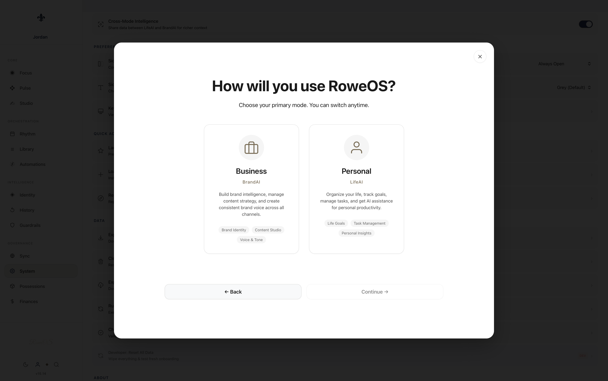

<p align="center">
  
</p>

<h1 align="center">RoweOS</h1>

<p align="center">
  <strong>Operating intelligence, built for brands & life.</strong>
</p>

<p align="center">
  <a href="https://roweos.com">Live App</a> &middot;
  <a href="#features">Features</a> &middot;
  <a href="#architecture">Architecture</a> &middot;
  <a href="#getting-started">Getting Started</a>
</p>

<p align="center">
  
  
  
  
</p>

---

## What is RoweOS?

RoweOS is a private AI platform with two modes of operation:

- **BrandAI** — Business intelligence with specialized agents for Strategy, Marketing, Operations, and Documents. Manage multiple brands, automate workflows, generate content, and post to social platforms.
- **LifeAI** — Personal life management with coaching archetypes for wellness, finance, and personal growth.

Built as a single-file web application with zero framework dependencies. Pure HTML, CSS, and vanilla JavaScript.

<p align="center">
  
</p>

## Features

### AI Agents & Studio
- Multi-provider AI routing (Anthropic Claude, OpenAI GPT, Google Gemini)
- **RoweOS AI** smart routing — automatically selects the best model for each task
- Studio with 50+ operations: content generation, strategy, social media, video
- WYSIWYG email composer with branded templates
- Deep research mode with multi-step reasoning

### Automation & Scheduling
- Visual pipeline builder for multi-step workflows
- Recurring task scheduler (daily, weekly, custom cron)
- Social media posting (X/Twitter, Instagram, Threads)
- Cloud scheduler for background execution via Vercel Cron

### Brand Management
- Multi-brand portfolio with per-brand settings, colors, and logos
- Brand identity system with voice, audience, and strategy profiles
- Shareable brand configurations via join links
- Inventory and client tracking

### Content & Media
- Image generation (Gemini Imagen, DALL-E)
- Video generation (Google Veo)
- Library with folder organization, favorites, and cross-brand search
- Export to Markdown, HTML, PDF, DOCX

### Life Intelligence
- Multiple life profiles with coaching archetypes
- Pulse goal tracking with AI-suggested tasks
- Rhythm daily planner with routine management
- Focus dashboard with unified task management

### Platform
- Progressive Web App (PWA) — installable on iOS, Android, desktop
- Firebase sync across devices
- Push notifications
- Dark/light theme with per-brand accent colors
- Responsive design (desktop + mobile)

<p align="center">
  
</p>

## Architecture

RoweOS is intentionally built as a **single-file application** — no build tools, no bundler, no framework.

```
RoweOS/dist/
  index.html          ~139,000 lines (CSS + HTML + JS in one file)
  api/                Vercel serverless functions
    scheduler.js      Cloud cron scheduler
    social-post.js    Social media posting
    social-auth.js    OAuth token exchange
    push.js           Push notifications
    resend-welcome.js Email sending via Resend
    stripe-webhook.js Subscription management
    ...
  sw.js               Service worker (PWA + push)
  manifest.json       PWA manifest
```

### Key Design Decisions

| Decision | Rationale |
|----------|-----------|
| Single HTML file | Zero build step, instant deployment, no dependency hell |
| Vanilla JS (ES5) | Maximum compatibility, no transpilation needed |
| No framework | Full control, no abstraction tax, ships exactly what's written |
| Direct API calls | Browser calls AI providers directly — no proxy server needed |
| localStorage first | Offline-capable, instant reads, Firebase sync as enhancement |
| Inline styles in emails | Email client compatibility (Gmail, Outlook, Apple Mail) |

### Data Flow

```
Browser (index.html)
  ├── localStorage (primary store)
  ├── Firebase Firestore (sync layer)
  ├── AI Providers (Anthropic / OpenAI / Google — direct from browser)
  └── Vercel Serverless (social posting, scheduling, email, push)
```

### Tech Stack

- **Frontend:** HTML, CSS, vanilla JavaScript (ES5)
- **AI:** Anthropic Claude, OpenAI GPT, Google Gemini (direct browser API calls)
- **Auth & Sync:** Firebase Authentication + Firestore
- **Hosting:** Vercel (static + serverless functions)
- **Email:** Resend
- **Payments:** Stripe
- **Push:** Web Push API + VAPID
- **CDN Dependencies:** Firebase SDK, Marked.js (markdown parsing)

## Getting Started

### Prerequisites

- A [Vercel](https://vercel.com) account for hosting
- API keys for at least one AI provider:
  - [Anthropic](https://console.anthropic.com/) (Claude)
  - [OpenAI](https://platform.openai.com/) (GPT)
  - [Google AI Studio](https://aistudio.google.com/) (Gemini)

### Deploy Your Own

1. **Clone the repo**
   ```bash
   git clone https://github.com/jordanrrowe-shadow/roweos.git
   cd roweos
   ```

2. **Deploy to Vercel**
   ```bash
   cd RoweOS/dist
   npx vercel --prod
   ```

3. **Open the app** and enter your API keys in Settings

### Optional: Firebase Sync

To enable cross-device sync:

1. Create a [Firebase project](https://console.firebase.google.com/)
2. Enable Authentication (Email/Password + Google Sign-In)
3. Enable Firestore Database
4. Add your Firebase config to the app's Settings

### Optional: Environment Variables (Vercel)

For serverless features (social posting, email, push notifications, scheduling):

| Variable | Purpose |
|----------|---------|
| `FIREBASE_PROJECT_ID` | Firebase project ID |
| `FIREBASE_SERVICE_ACCOUNT` | Firebase service account JSON |
| `RESEND_API_KEY` | Email sending via Resend |
| `VAPID_PRIVATE_KEY` | Push notification signing |
| `VAPID_SUBJECT` | Push notification contact |
| `STRIPE_SECRET_KEY` | Subscription billing |
| `STRIPE_WEBHOOK_SECRET` | Stripe webhook verification |

## Screenshots

<table>
  <tr>
    <td></td>
    <td></td>
  </tr>
  <tr>
    <td align="center"><em>Brand Identity</em></td>
    <td align="center"><em>Analytics</em></td>
  </tr>
  <tr>
    <td></td>
    <td></td>
  </tr>
  <tr>
    <td align="center"><em>Library</em></td>
    <td align="center"><em>Light Mode</em></td>
  </tr>
  <tr>
    <td></td>
    <td></td>
  </tr>
  <tr>
    <td align="center"><em>Focus Dashboard</em></td>
    <td align="center"><em>Onboarding</em></td>
  </tr>
</table>

## Development

RoweOS is a single-file app — edit `RoweOS/dist/index.html` directly.

```
Lines 1-15,000       CSS (themes, components, animations)
Lines 15,000-44,000  HTML (views, modals, overlays)
Lines 44,000-139,000 JavaScript (state, API calls, logic)
```

### Build & Deploy

```bash
# Full deploy (zip, git push, Vercel deploy)
./deploy.sh

# Manual deploy
cd RoweOS/dist && npx vercel --prod

# Build minified version only
./build.sh
```

### Code Style

- **ES5 JavaScript** — no arrow functions, no `let`/`const`, no template literals
- **Inline SVG icons** — never emoji
- **CSS custom properties** for theming (`--brand-accent`, `--bg-primary`, etc.)
- **Mobile-first** responsive design (`@media max-width: 768px`)

## License

[MIT](LICENSE) — The Rowe Collection, LLC

---

<p align="center">
  Built by <a href="https://therowecollection.com">The Rowe Collection</a> in Austin, Texas
</p>
