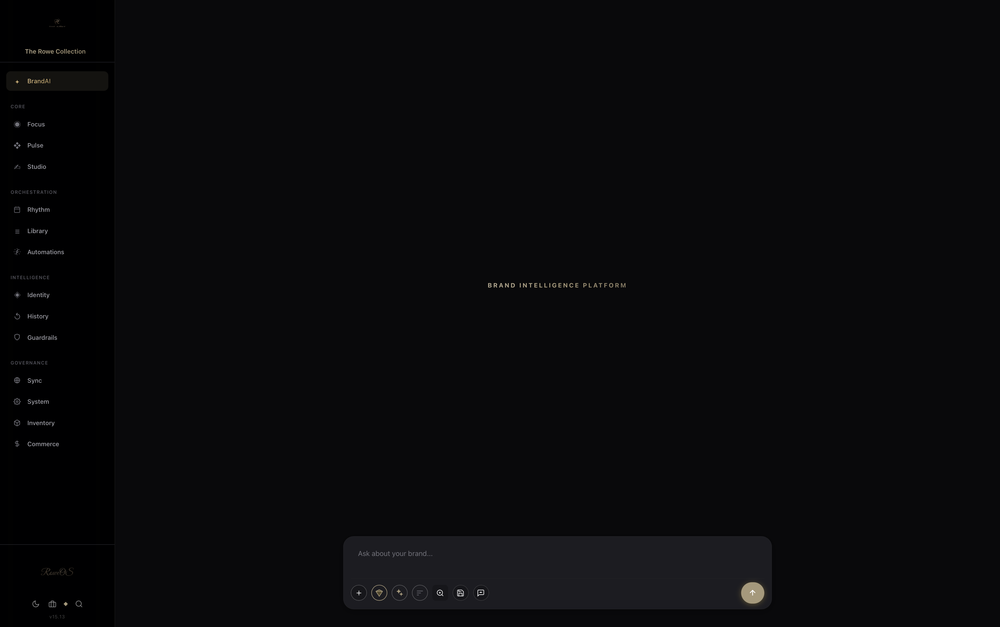
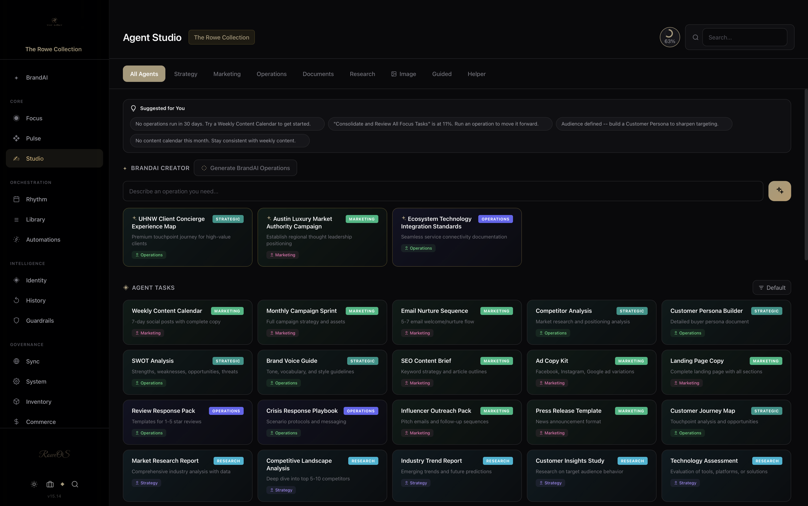
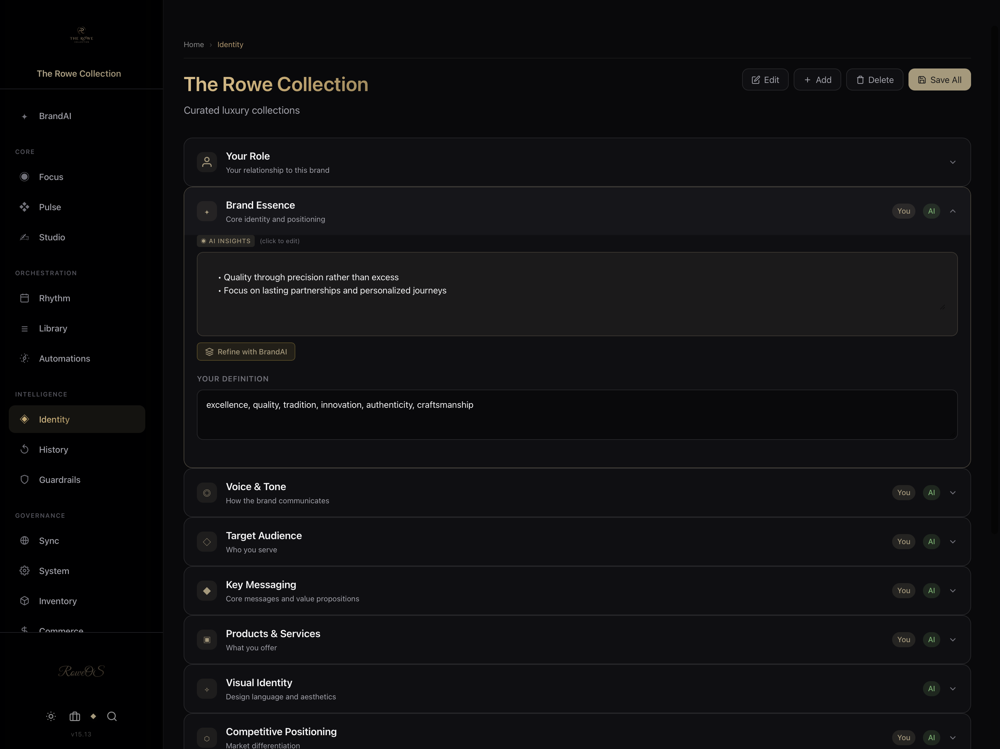
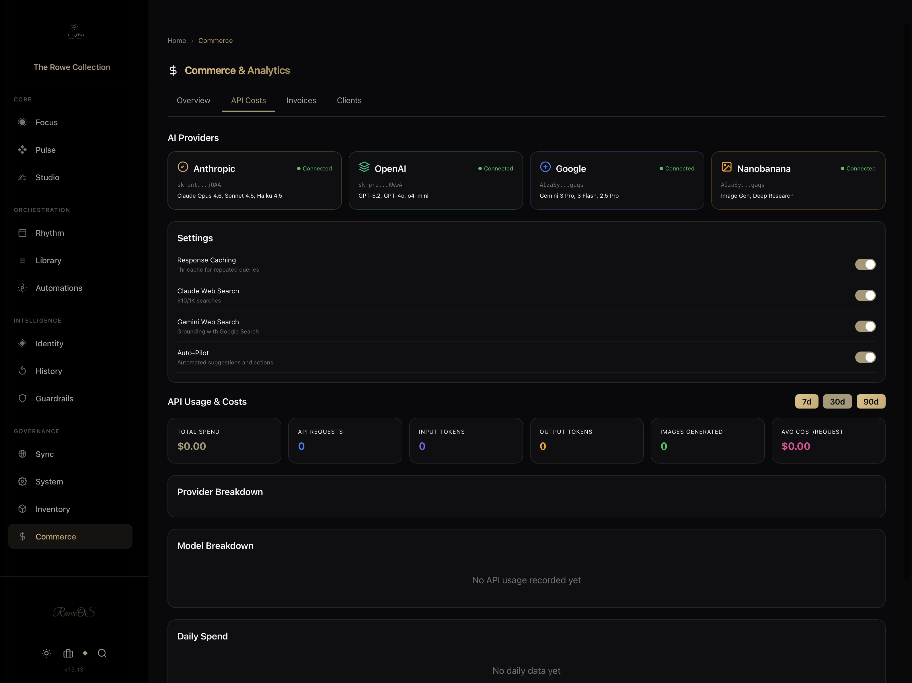
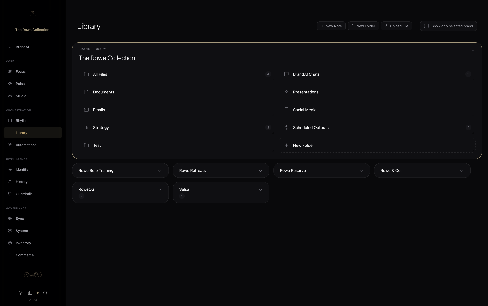
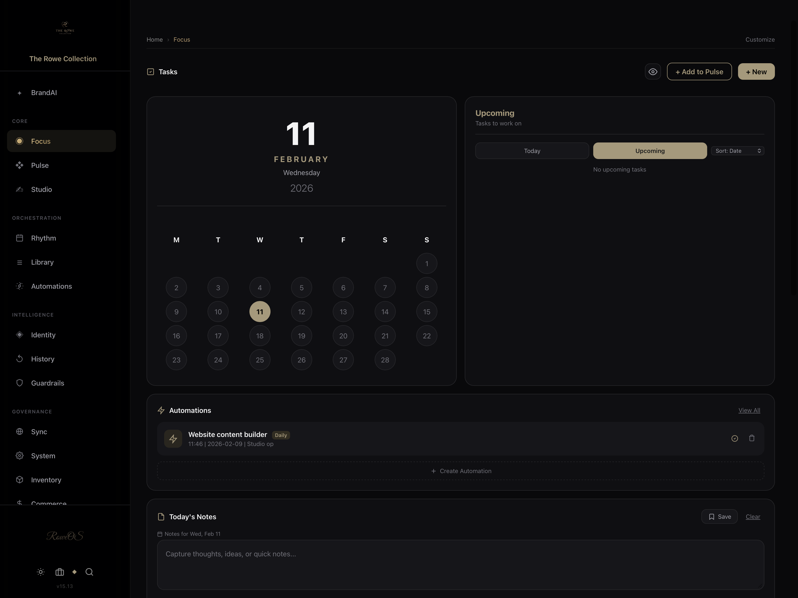
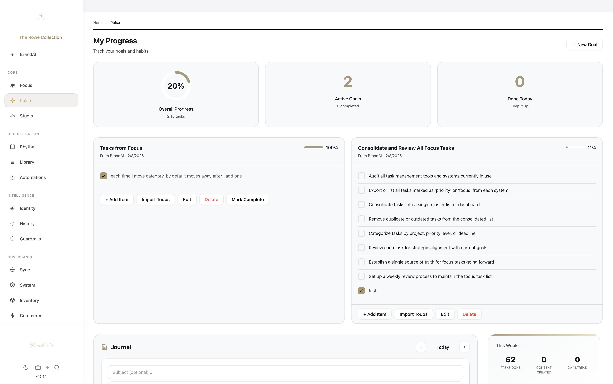

  

<h1 align="center">RoweOS</h1>

  <strong>Operating intelligence, built for brands & life.</strong>

  <a href="https://roweos.com"><strong>Get Started at roweos.com</strong></a>

  
  
  

---

  

## The AI platform that runs your brand

RoweOS gives you a team of AI agents purpose-built for brand operations. Strategy, marketing, content, documents, social media, scheduling, image and video generation -- all in one place, running on your choice of AI provider.

**Not another chatbot.** RoweOS is a full operating system for brand intelligence.

 

### Two Modes. One Platform.

**BrandAI** -- Business operations with 4 specialized agents (Strategy, Marketing, Operations, Documents). Manage a portfolio of brands, each with its own identity, voice, color system, and agent configuration.

**LifeAI** -- Personal intelligence with coaching archetypes for wellness, finance, productivity, and personal growth.

 

## What You Get

### AI Studio
50+ pre-built operations across content, strategy, social media, and video. Run any operation, edit the output in a rich editor, save to your library, export to PDF/DOCX/HTML, or email it with branded templates.

### Smart Routing
**RoweOS AI** automatically picks the best model for each task -- Claude for writing, GPT for code, Gemini for multimodal. Or choose your own. Bring your own API keys for Anthropic, OpenAI, and Google.

### Automation Engine
Build multi-step pipelines with a visual builder. Schedule recurring tasks -- content generation, social posting, goal tracking, notifications. Runs in the cloud even when your browser is closed.

### Social Publishing
Connect X/Twitter, Instagram, and Threads. Compose and schedule posts with AI-generated content and images. OAuth-based, per-brand connections.

### Image & Video Generation
Generate images with Gemini Imagen and DALL-E. Generate video with Google Veo. All from the same interface, integrated into Studio and automations.

### Brand Identity System
Define your brand's voice, audience, strategy, tagline, and visual identity. Every AI interaction is informed by your brand context. Share brand configs with team members via join links.

### Library & Knowledge
Save any output to an organized library with folders, favorites, and cross-brand search. Export to Markdown, HTML, PDF, or DOCX.

### Cross-Device Sync
Firebase-powered sync keeps everything in lockstep across desktop, tablet, and phone. Install as a PWA on any device. Push notifications keep you informed.

 

<table>
  <tr>
    <td></td>
    <td></td>
  </tr>
  <tr>
    <td align="center"><em>Studio</em></td>
    <td align="center"><em>Brand Identity</em></td>
  </tr>
  <tr>
    <td></td>
    <td></td>
  </tr>
  <tr>
    <td align="center"><em>Analytics</em></td>
    <td align="center"><em>Library</em></td>
  </tr>
  <tr>
    <td></td>
    <td></td>
  </tr>
  <tr>
    <td align="center"><em>Focus Dashboard</em></td>
    <td align="center"><em>Light Mode</em></td>
  </tr>
</table>

 

## Built Different

RoweOS is a **single-file web application** -- ~139,000 lines of pure HTML, CSS, and vanilla JavaScript. No React. No Next.js. No build tools. No framework. Just code that ships exactly as written.

| | |
|---|---|
| **Zero dependencies** | No npm install, no node_modules, no bundler |
| **Multi-provider AI** | Anthropic Claude, OpenAI GPT, Google Gemini |
| **Your keys, your data** | API keys stored locally, never on our servers |
| **PWA** | Installable on iOS, Android, Mac, Windows |
| **Dark + Light** | Per-brand accent colors and full theme system |

 

## Get Access

RoweOS is available at **[roweos.com](https://roweos.com)**.

Sign up for the beta or purchase an access key to get started. Bring your own AI API keys -- RoweOS calls providers directly from your browser.

   
  <a href="https://roweos.com"><strong>Launch RoweOS</strong></a>
    

## License

[MIT](LICENSE) -- The Rowe Collection, LLC

---

  Built by <a href="https://therowecollection.com">The Rowe Collection</a> in Austin, Texas

